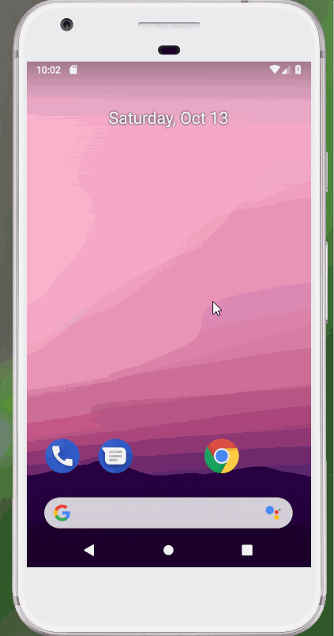

## Flash_Card

### App Description
I can make a flashcard like app. Once the question is clicked the answer will appear and the question will disappear.  

### App Walk-though` 

## Required
- [x] Create New Project in Android Studio
- [x] Add a view for the front side of the flashcard to display the question
- [x] Add a view for the back side of the flashcard to display the answer
- [x] Build in logic to show the answer side when the card is tapped
- [x] Push code to GitHub
## Optional
- [ ] toggle the flashcard between the question side and the answer side
- [ ] Style the question and answer side of the card to better distinguish between the two sides
- [ ] Add selectable multiple choice answers beneath the card
   - [ ] Change the background color of the multiple choice answers when clicked to indicate whether the question waanswered correctly
